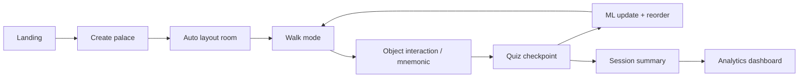
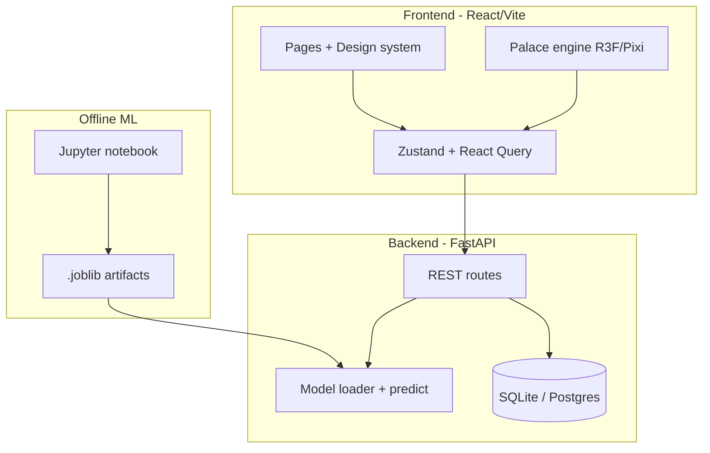

# Remind — Design & Implementation Plan

**Tagline:** Turn anything into a spatial memory.  
**Concept:** A personalized digital memory palace: users supply concepts, the system places them as objects in a navigable space, quizzes them while they “walk” the room, and ML predicts what they will forget to reorder and reinforce weak items.

**Status:** Pre-build planning (aligned to ML + FSD case study rubric).

---

## 1. Rubric alignment (how we score on all four buckets)

| Rubric area | Weight | How Remind satisfies it |
|-------------|--------|-------------------------|
| ML pipeline | 40% | EDA → preprocessing → feature engineering → **multiple models** (logistic regression, Random Forest, XGBoost/LightGBM, optional small NN) with **k-fold cross-validation**, grid/random search, comparison table (AUC, F1, calibration). Primary task: **binary forgetting within horizon H** (e.g. 7 days) or **next-quiz correctness**. Secondary: **rank concepts for next review** (learning-to-rank or score = P(forget)). |
| FSD integration | 20% | React UI → FastAPI → `.joblib` models; live predictions drive **which object glows**, **walk order**, and **quiz difficulty**. |
| Deployment + demo | 20% | Docker Compose or clear README; optional hosted frontend + API; **60-second demo script** (see §8). |
| Clarity & presentation | 20% | Architecture diagram, EDA slides from notebook, screenshots of palace + analytics dashboard. |

**Dataset (confirmed):** Use the **strongest public spaced-repetition / forgetting dataset** available (reliability and size over geographic tagging). Primary candidates to evaluate in notebook:

1. **[FSRS / Open Spaced Repetition community exports](https://github.com/open-spaced-repetition)** — review logs with intervals, ratings, retrievability.
2. **Anki shared deck statistics** (where license permits) or aggregated SRS benchmarks from FSRS papers.
3. **Duolingo SLAM / shared retention** (if accessible) as secondary comparison.

Frame the **product narrative** around learners mastering dense topics (e.g. **ML concepts demo deck**); cite dataset provenance and CV metrics clearly for the rubric.

**Note on rubric “Indian context”:** If evaluators strictly require it, add a short slide tying use cases to Indian exam prep **without** changing the core dataset—optional follow-up, not blocking MVP.

---

## 2. Product principles (UI/UX)

1. **One clear job:** “Memorize this list” → palace → walk → quiz → see what stuck.
2. **Spatial first, chrome second:** Full-bleed environment; controls float minimally (glass panels, no clutter).
3. **Progressive disclosure:** Landing → paste concepts → **instant palace** → guided first walk → analytics for power users.
4. **Delight without gimmicks:** Subtle parallax, object “memory anchors” (icons + short mnemonics from optional LLM/heuristics), haptic-like micro-interactions (scale, glow on recall success).
5. **Trust the ML:** Always show *why* an object was prioritized (“Predicted 68% forget probability · last seen 4 days ago”).
6. **Demo mode:** Pre-loaded “15 JEE Physics formulas” deck for judges with zero setup.

**Visual direction**

- **Palette:** Deep indigo/navy space (`#0B1020`), warm accent (`#F59E0B` / amber for “focus”), success mint (`#34D399`), surfaces with `backdrop-blur` and 1px hairline borders.
- **Type:** Display: **Fraunces** or **Instrument Serif**; UI: **DM Sans** or **Geist**—distinct, not generic Inter-only.
- **Motion:** Framer Motion page transitions; object idle float; reduced-motion respect `prefers-reduced-motion`.

---

## 3. User personas & flows

### Persona A — Exam crammer (primary demo)
Pastes 15 concepts → walks room once → fails 3 → system repositions those objects nearer the “path” and schedules re-quiz.

### Persona B — Instructor / presenter
Uses demo deck + analytics slide export for PPT.

### Flow (happy path)



---

## 4. Information architecture & screens

| Screen | Purpose | Key components |
|--------|---------|----------------|
| **Landing** | Wow + rubric story | Hero with subtle 3D/2.5D preview, “Try demo”, “Create palace” |
| **Create** | Input | Textarea (one concept per line), optional title, template chips (**ML Concepts (demo KB)**, Custom list), validation (3–30 items) |
| **Palace builder** (auto) | Instant gratification | Progress “Placing objects…”, preview thumbnail, edit object labels |
| **Walk** | Core experience | WASD / click-to-move OR click hotspots; minimap; current objective chip |
| **Object detail** | Encoding | Concept text, **KB-backed icon/prop + short anchor phrase**, user-editable notes, “link to location” copy |
| **Quiz** | Assessment | MCQ, self-grade (Again/Hard/Good/Easy → SM-2-like labels for features), typing recall |
| **ML insights** | Rubric + wow | Forgetting curve chart, “next best object”, model comparison *link to notebook* |
| **Analytics** | Session history | Accuracy over time, heatmap of room zones, export CSV for notebook |
| **About / Method** | Presentation aid | Architecture, dataset citation, CV metrics summary |

---

## 5. Spatial experience: 2D vs 3D (recommendation)

**Recommended for 3-week timeline:** **2.5D isometric palace** (React + **PixiJS** or **React Three Fiber** with fixed camera).

| Option | Pros | Cons |
|--------|------|------|
| **2D isometric (PixiJS)** | Fast, mobile-friendly, easy hit-testing | Less “wow” than full 3D |
| **3D room (R3F + drei)** | Maximum demo impact | More perf/accessibility work |
| **Hybrid** | R3F room + 2D UI overlay | **Best demo/effort ratio** ✓ |

**Room generation (v1):** Procedural grid → place N objects on walls/shelves/floor with collision-free layout; **ML reorder** = swap positions of high P(forget) items along the **default walk path** (path starts at door).

---

## 6. ML design

### 6.1 Problem formulation

**Primary label:** `will_forget` = 1 if user fails recall (or rating ≤ Hard) at next scheduled review within horizon **H** days.

**Features (per concept × review event):**

| Feature | Source |
|---------|--------|
| `elapsed_days_since_last_review` | Session log |
| `review_count`, `success_streak`, `fail_streak` | Session log |
| `avg_response_time_ms` | Quiz UI |
| `quiz_type` (MCQ vs recall) | Quiz UI |
| `position_index_on_path`, `zone_id` | Palace layout |
| `session_duration`, `time_of_day` | Telemetry |
| `concept_text_length`, `embedding_norm` (optional) | NLP |
| `education_level`, `state_region` (optional) | User profile / synthetic Indian context |

**Secondary output:** `forget_probability` ∈ [0,1] for UI ranking.

### 6.2 Pipeline (notebook deliverable)

1. **Data:** Download SRS logs → clean → merge synthetic Indian context features → train/val/test split **by user** (avoid leakage).
2. **EDA:** Histograms of intervals, correlation heatmap, forgetting by interval bucket.
3. **Preprocessing:** Impute missing intervals, standardize numerics, one-hot categoricals.
4. **Models:** Logistic Regression (baseline), Random Forest, Gradient Boosting (XGBoost/LightGBM), optional MLP.
5. **CV:** Stratified k-fold (k=5) on training; report mean ± std F1/AUC.
6. **Tuning:** GridSearchCV/RandomizedSearchCV on best family.
7. **Evaluation:** Hold-out test; calibration plot for probabilities; feature importance (SHAP optional).
8. **Artifacts:** `forget_model.joblib`, `preprocessor.joblib`, `metadata.json` (metrics, feature list).

### 6.3 Online learning (product, post-demo)

- Append user events to local SQLite → nightly retrain optional; **demo uses frozen model + heuristic fallback** if API down.

### 6.4 API contract (FastAPI)

```
POST /api/v1/predict-forgetting
Body: { user_id, concept_id, features: {...} }
Response: { forget_probability, recommended_priority, explanation_keys[] }

POST /api/v1/rank-concepts
Body: { user_id, concepts: [{ id, features }] }
Response: { ordered_ids[], scores[] }

POST /api/v1/events
Body: { quiz_result, timestamps, layout... }  // logging for analytics + future retrain
```

---

## 7. System architecture



**Suggested stack**

| Layer | Choice | Rationale |
|-------|--------|-----------|
| Frontend | Vite + React 19 + TypeScript | Fast dev, component ecosystem |
| Styling | Tailwind v4 + shadcn/ui (custom theme) | Polished UI quickly |
| 3D | `@react-three/fiber`, `@react-three/drei` | Demo wow |
| State | Zustand + TanStack Query | Simple + cache API |
| Backend | FastAPI + pydantic v2 | Rubric-friendly Python |
| DB | SQLite (dev) → Postgres optional | Session & events |
| ML | scikit-learn + XGBoost + pandas | Rubric models + CV |
| Monorepo | `apps/web`, `apps/api`, `ml/notebook`, `ml/artifacts` | Clear deliverables |

### 7.1 Deployment (confirmed: Vercel)

- **`apps/web`** → **Vercel** (static/SSR as needed).
- **`apps/api` (FastAPI)** → **Railway, Render, or Fly.io** (Python + `joblib` load); set `VITE_API_URL` in Vercel env.
- **ML training** runs locally / CI; commit **metrics + notebook**, ship **artifacts** to API host or bundle in Docker image.
- **Fallback:** If API cold-start fails during demo, frontend uses **SM-2-style heuristic** for ordering (same UI, banner “offline scoring”).

---

## 15. One-week MVP scope (confirmed timeline)

**Must ship**

- [ ] Landing + polished theme (dark, serif/sans pairing, motion).
- [ ] **ML Concepts** demo deck (~15 items) from **concept KB** (`ml/concepts.json` + `ml/prop-map.json`).
- [ ] 3D room: fixed camera, click-to-focus objects, path reorder after quiz.
- [ ] Quiz loop (MCQ + self-grade) → events → **POST rank/predict** → reposition high P(forget) objects.
- [ ] FastAPI + loaded model; notebook with EDA, **≥3 models**, **5-fold CV**, comparison table.
- [ ] README: run web + API locally; Vercel deploy steps.

**Defer if slipping**

- Full analytics dashboard (keep **session summary** modal only).
- Multiple room themes; user-authored prop uploads.
- Postgres (use localStorage + optional SQLite on API).

**Demo deck (ML concepts — initial KB examples)**

Cross-validation, bias–variance, gradient descent, regularization, precision/recall, ROC-AUC, feature engineering, train/test leak, k-fold, hyperparameters, ensemble, overfitting, embedding, loss function, learning rate — each mapped to a **3D prop** (e.g. “overfitting” → vine-covered statue, “gradient descent” → stepped ramp).

---

## 8. Live demo script (~90 s)

1. Open landing → **“Try JEE demo”** (15 concepts).
2. Palace generates → **Walk** to glowing object (ML-ranked highest P(forget) after first miss).
3. Fail one quiz → summary shows **“Reinforced: 3 concepts repositioned”**.
4. Open **Analytics** → forgetting curve + **“Model: LightGBM, CV AUC 0.XX”**.
5. Show **Network tab**: `POST /predict-forgetting` → probability on screen.

---

## 9. Phased delivery (3 weeks)

| Week | Milestone |
|------|-----------|
| **1** | Dataset + notebook EDA/CV; FastAPI stub + joblib load; landing + create + static palace layout |
| **2** | Walk + quiz loop; event logging; ML-driven reorder; polish UI theme |
| **3** | Analytics dashboard; README + Docker; PPT assets; rehearsal demo; optional deploy |

**MVP cut line (if time slips):** 2D hotspots instead of full walk; keep ML API + quiz + reorder.

---

## 10. Non-functional requirements

- **Performance:** LCP < 2.5s on demo laptop; palace lazy-loaded.
- **A11y:** Keyboard quiz path; contrast AA; reduced motion.
- **Mobile:** Walk mode simplified (tap objects list + quiz) — rubric asks mobile-friendly.
- **Privacy:** No PII required; localStorage session default.

---

## 11. Risks & mitigations

| Risk | Mitigation |
|------|------------|
| Indian dataset not a perfect fit | Document transfer learning + synthetic context features from data.gov.in |
| 3D scope creep | Fixed camera, one room template, procedural props library |
| Model accuracy modest | Optimize **ranking** for UX; show calibration + baseline beat |
| Live demo failure | Offline fallback scores (SM-2 heuristic) when API unreachable |

---

## 12. Open decisions (see questions to stakeholder)

Tracked in `docs/DECISIONS.md` once answered.

---

## 13. Repository structure (planned)

```
remind/
├── apps/web/                 # React frontend
├── apps/api/                 # FastAPI
├── ml/
│   ├── notebook/             # Case study notebook
│   ├── train.py              # Reproducible training script
│   └── artifacts/            # .joblib (gitignored or LFS)
├── docs/
│   ├── DESIGN.md             # This file
│   └── DECISIONS.md
├── docker-compose.yml
└── README.md
```

---

## 14. Success criteria (subjective “super impressive”)

- [ ] First-time user sees a palace in **< 10 s** after paste.
- [ ] At least one moment where **ML visibly changes** the room or path.
- [ ] Notebook + UI tell a **coherent story** for Indian learners.
- [ ] Visual design feels **intentional** (typography, motion, dark luxury aesthetic)—not a default Bootstrap form.

---

*Document version: 0.1 — planning phase*
